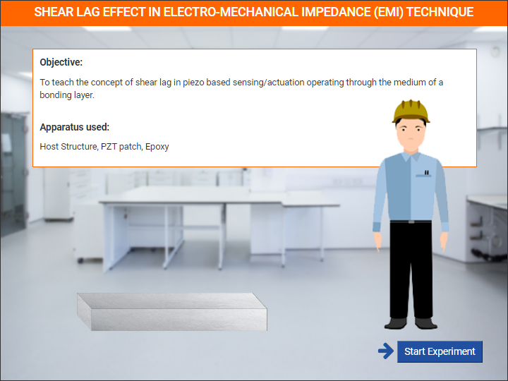
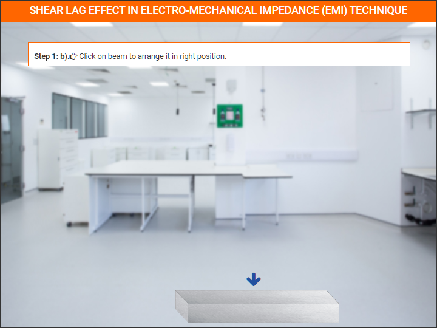
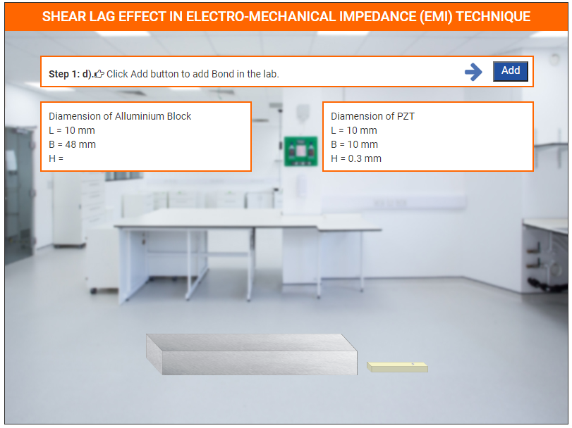
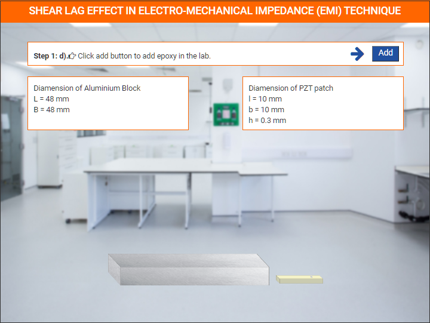
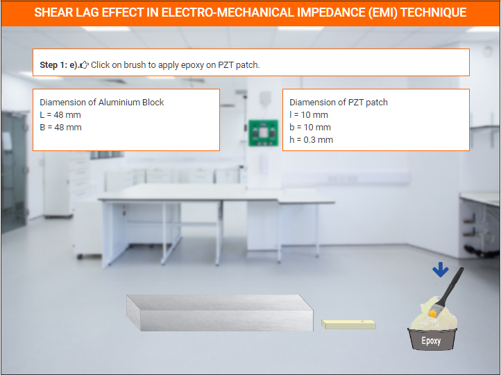
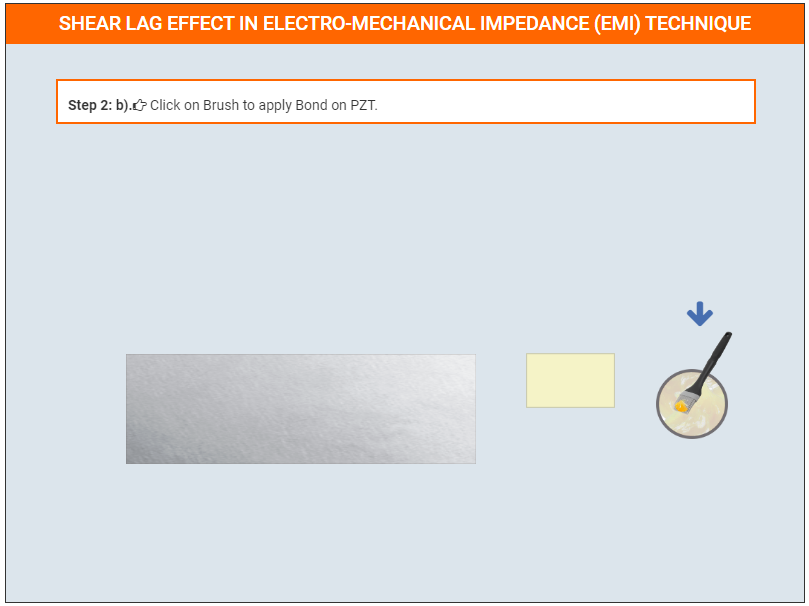
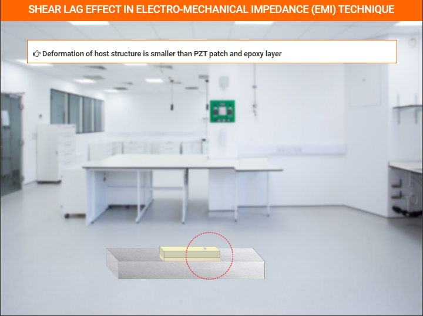
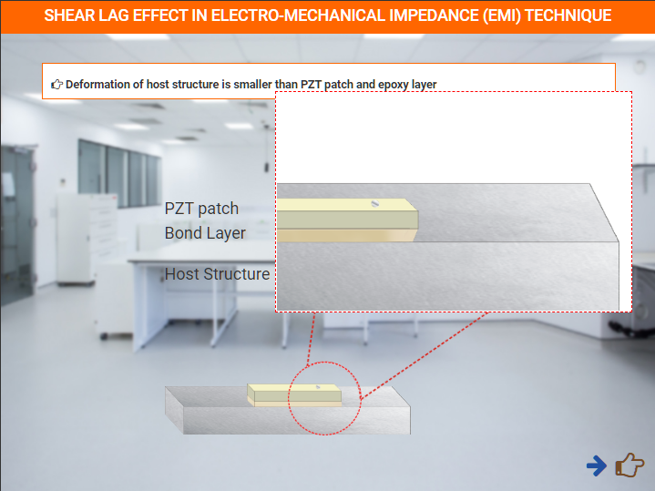
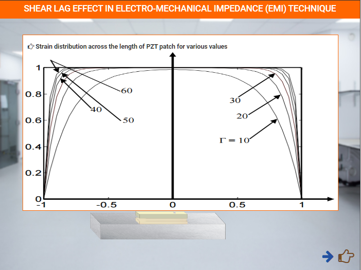
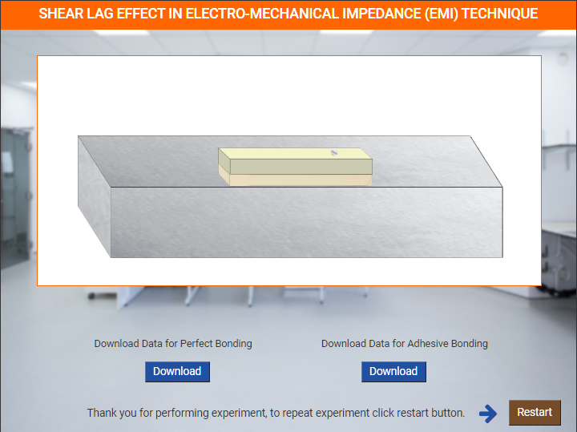

### These steps will be followed for the experiment

<!-- **PRE EXPERIMENT QUIZ QUESTIONS**
	
1) What is shear lag effect?
2) How does thickness of bond layer affect strain transfer to/from the PZT patch to the structure?
3) How does the Young’s modulus of elasticity of bond layer affect strain transfer to/from the PZT patch to the structure? -->

#### Preparation of specimens:

Click on start experiment button to start the experiment.

Step 1: a). Click on add button to add beam in the lab.

Step 1: b). Click on beam to arrange it in right position.

Step 1: c). Click add button to add PZT patch in the lab.

Step 1: d). Click add button to add epoxy in the lab.

Step 1: e). Click on brush to apply epoxy on PZT patch.

Step 1: f). Click on PZT patch to fix it on beam.

Deformation of host structure is smaller than PZT patch and epoxy layer

Click on next button to show graph

  
Graph
 

Click on download button to download data.

After click restart button

<!-- **POST EXPERIMENT QUIZ QUESTIONS**

1) How does the presence of bond layer affect conductance signature as
compared to perfect bonding case?
2) How do the Young’s modulus of elasticity and the thickness of bond
layer affect the sharpness of peaks of conductance signature? -->
